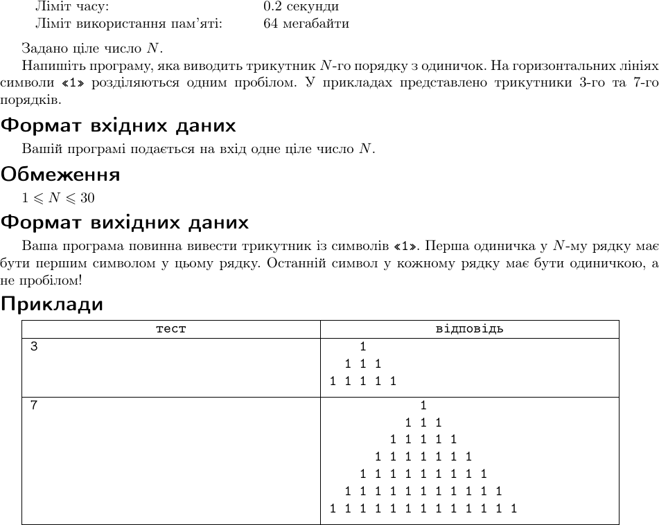

# Lab Work Report №2

## Навчальна дисципліна "Програмування для мобільних пристроїв"

### Виконала:
- Бабачанах К.С.
- група 6.04.122.010.21.2

## Хід роботи

Усього було 10 задач, які я змогла зробити на 100 балів. Задачі з id 1201, 1234, 1263, 1273 та 1285 я зробила з першої спроби, у мене не виникло ні яких питаннь щодо ціх задач.

З рештою завдань у мене виниклі труднощі, про які я розповім далі.

- Завдання з id 1299
  

Перше мое рішення було 86,40 балів та помилка WA. Помилка була в тому що я не додала умову "Якщо M більше N то немає чисел, які відповідають умові задачі". Після додавання цієї умови до коду, я отримала 100 балів за це завдання.

- Завдання з id 1217
  

Помилка була в тому що спочатку я зробила неправильний порядок виведення. 

- Завдання з id 1227
  

Спочатку я зробила вірно, але я отримала помилку TL, яка обозначає що рішення витрачає багато часу. Тому потрібно було оптимизувати мою програму.

- Завдання з id 1292
  

Це завдання, на яке я витратила найбільше часу та спроб. Усі спроби були з помилкою WA. Я зовсім не розуміла у чому причина. Потім я знайшла в інтернеті це завдання з поясненням як його потрібно робити, за яким принципом. Отже, у результаті я змогла його виконати на 100 балів.

- Завдання з id 1262
  

Помилка була в тому що спочатку я зробила неправильне виведення трикутна n-порядка через не уважність при читанні умови.

## Висновок

Під час виконання лабораторної роботи №2 я успішно вирішила 10 задач, п'ять з яких з першої спроби. Завдання з id 1299, 1217, 1227, 1292 та 1262 викликали додаткові труднощі, пов'язані з логічними помилками та необхідністю оптимізації коду. Однак, з подальшим аналізом та корекцією, я досягла успіху, що підтверджує мої навички та здатність адаптуватися до викликів в області програмування. Цей досвід дав мені цінні знання.

